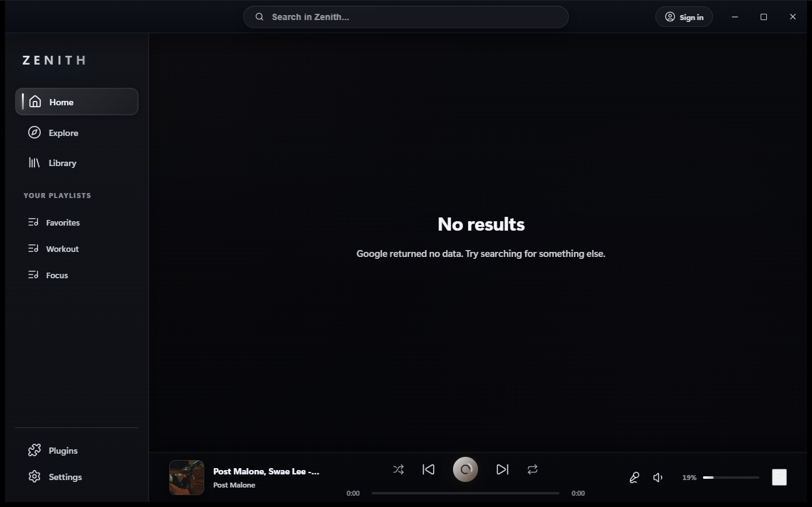
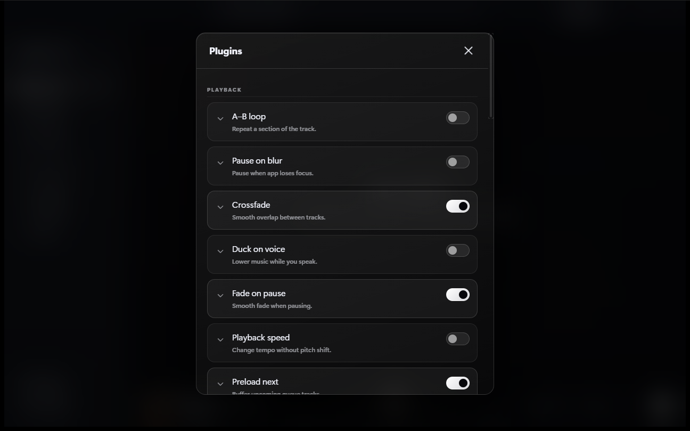

# Zenith Player

Desktop music player for Windows, macOS, and Linux. Tauri 2, React 19, TypeScript.

The project is independent. It is not a Google or YouTube product, and it does
not host a music catalog. Browse data and playback URLs come from YouTube Music;
the MIT license covers Zenith source code only. Details: [DISCLAIMER.md](./DISCLAIMER.md),
[NOTICE.md](./NOTICE.md).

---

## Stack

| Component     | Implementation                                                          |
| ------------- | ----------------------------------------------------------------------- |
| Catalog       | YouTube Music InnerTube (public web browse, search, library)            |
| Playback      | HTML `<audio>` in the desktop WebView                                   |
| Stream URL    | yt-dlp `-g` (print URL, no file). InnerTube `/player` if that fails     |
| Local proxy   | `127.0.0.1` so the WebView can fetch googlevideo (CORS)                 |
| Sign-in       | Optional Google login in a WebView. Session cookies stay on this device |
| Lyrics        | LRCLib, Musixmatch, Genius, lyrics.ovh, YouTube captions                |
| yt-dlp binary | Fetched into local app data when needed. Not stored in this repository  |

Search uses InnerTube. If the response is empty, metadata may come from yt-dlp
`ytsearch` (id, title, cover). The app does not write audio or video files to
disk. Pull requests that add an export or "download MP3" path are rejected.

---

## Features

| Area      | Description                                                               |
| --------- | ------------------------------------------------------------------------- |
| Browse    | Home, Explore, Moods, Search, Library from live YouTube Music shelves     |
| Playback  | Queue, shuffle, loop, crossfade, preload, A-B loop, sleep timer, speed    |
| Lyrics    | Several providers, synced rail, karaoke, overlay and second-screen window |
| Plugins   | 31 toggles (playback, visual, social, utility), English and Polish labels |
| Sign-in   | Optional Google login for library and playlists                           |
| Languages | English and Polish                                                        |

---

## Screenshots

| Home                                         | Player                                          |
| -------------------------------------------- | ----------------------------------------------- |
|         |        |

| Explore                                      | Plugins                                         |
| -------------------------------------------- | ----------------------------------------------- |
|   |      |

Library (signed in): [docs/screenshots/03-library.png](docs/screenshots/03-library.png)

---

## Layout

```
zenith-player/
├── index.html              # Main window
├── mini.html               # Mini player
├── overlay.html            # Lyrics overlay
├── vite.config.ts
├── package.json
│
├── src/
│   ├── main.tsx
│   ├── App.tsx             # Shell, routing, playback state
│   ├── App.css
│   ├── i18n.ts
│   ├── api/youtube.ts      # InnerTube browse, search, lyrics, library
│   ├── audio/dualAudio.ts  # Two-deck crossfade
│   ├── components/
│   ├── constants/
│   ├── hooks/
│   ├── plugins/
│   ├── utils/
│   ├── mini/
│   └── overlay/
│
├── src-tauri/
│   ├── src/
│   │   ├── lib.rs          # Commands, tray, login window
│   │   ├── auth_store.rs
│   │   ├── deps.rs         # Boot InnerTube client scrape + yt-dlp refresh
│   │   ├── ytm_api.rs
│   │   ├── ytdlp.rs
│   │   ├── player.rs       # InnerTube /player fallback
│   │   ├── stream.rs       # URL resolve + proxy hand-off
│   │   ├── stream_proxy.rs
│   │   ├── discord.rs
│   │   ├── room.rs
│   │   └── windows.rs
│   ├── Cargo.toml
│   └── tauri.conf.json
│
└── scripts/
    └── gen-icon.py
```

---

## Requirements

- Node.js 20+ and pnpm 9+
- Rust stable
- Windows, macOS, or Linux (Windows is the primary target)

---

## Commands

```bash
pnpm install
pnpm tauri dev
pnpm typecheck
pnpm format
pnpm build
pnpm dist
```

Restart `pnpm tauri dev` after Rust changes under `src-tauri/`.

Use of a local build remains subject to [YouTube's Terms of Service](https://www.youtube.com/t/terms)
and [Google's Terms of Service](https://policies.google.com/terms).

---

## Installers

| Platform | Artifacts                           | Build                                       |
| -------- | ----------------------------------- | ------------------------------------------- |
| Windows  | One NSIS, one MSI, one portable zip per arch (`x64` and `x86`) | `pnpm dist:win` |
| macOS    | `.dmg` (and `.app`)                 | GitHub Actions `macos-latest`               |
| Linux    | One `.AppImage` + one `.deb` (amd64) | `pnpm dist:linux` (Docker or WSL); CI `ubuntu-22.04` |

`pnpm dist:linux` uses Docker when the engine is up, otherwise WSL. First-time
Windows setup: enable WSL + Virtual Machine Platform, install Docker Desktop
or Ubuntu, then **one reboot** so WSL2 actually starts. After that the script
writes `dist-artifacts/linux/`. GitHub Actions is the fallback if you do not
want a local Linux toolchain.

Bundle id: `com.zenithplayer.desktop`. On Windows, app data lives under
`%LOCALAPPDATA%\com.zenithplayer.desktop`.

CI on `main` and pull requests runs typecheck, Prettier, Vite build, `cargo fmt`,
and `cargo check`. Full installers are built by [`.github/workflows/release.yml`](.github/workflows/release.yml)
on a `v*` tag.

Do not rename the shipped product to "YouTube Music" or similar. Installer
strings in `src-tauri/tauri.conf.json` must stay under the Zenith name.

### GitHub release

```bash
git init
git add .
git commit -m "Release Zenith 1.0.0"
git remote add origin git@github.com:YOU/zenith-player.git
git branch -M main
git push -u origin main
git tag v1.0.0
git push origin v1.0.0
```

Windows SmartScreen treats unknown publishers as untrusted. A self-signed
cert does not clear the warning for files downloaded from the internet.

Azure Artifact Signing is not free. Microsoft charges about $9.99/month, needs
a paid pay-as-you-go subscription, and does not allow trial or sponsored
accounts. Individual developers outside the USA and Canada cannot enroll.
This project is MIT OSS, so the Release workflow uses **SignPath Foundation**
for free Authenticode (apply at https://signpath.org). Azure remains an
optional paid path if you later have a qualifying organization account.

| Audience                       | What to do                                                            |
| ------------------------------ | --------------------------------------------------------------------- |
| This PC, `pnpm dist:win`       | `pnpm codesign:dev` then `pnpm codesign:trust` (Administrator)        |
| GitHub downloads (free)        | SignPath Foundation: API token + org/project GitHub Actions variables |
| GitHub downloads (paid)        | Azure Artifact Signing secrets, or your own OV/EV PFX                 |
| Skip signing                   | `ZENITH_SKIP_CODESIGN=1`                                              |

`tauri.conf.json` runs `scripts/sign-windows.ps1` on each Windows binary
(SHA-256, RFC 3161 timestamp). Local `pnpm dist:win` signs with the trusted
publisher cert on this machine.

### GitHub secrets and variables (Release workflow)

Free path (SignPath). Apply, then set:

| Name                         | Where     | Purpose                    |
| ---------------------------- | --------- | -------------------------- |
| `SIGNPATH_API_TOKEN`         | Secret    | SignPath API token         |
| `SIGNPATH_ORGANIZATION_ID`   | Variable  | SignPath organization id   |
| `SIGNPATH_PROJECT_SLUG`      | Variable  | Project slug in SignPath   |

Paid path (Azure Artifact Signing), used only when SignPath is not configured:

| Secret                               | Purpose                                   |
| ------------------------------------ | ----------------------------------------- |
| `ZENITH_CODESIGN_PFX_BASE64`         | Your own Authenticode PFX, base64         |
| `ZENITH_CODESIGN_PASSWORD`           | PFX password                              |
| `AZURE_CLIENT_ID`                    | Azure app (OIDC)                          |
| `AZURE_TENANT_ID`                    | Azure tenant                              |
| `AZURE_SUBSCRIPTION_ID`              | Azure subscription (for `azure/login`)    |
| `AZURE_TRUSTED_SIGNING_ENDPOINT`     | e.g. `https://wus.codesigning.azure.net/` |
| `AZURE_TRUSTED_SIGNING_ACCOUNT`      | Artifact Signing account name             |
| `AZURE_TRUSTED_SIGNING_PROFILE`      | Certificate profile name                  |

```bash
pnpm dist:win
pnpm dist:linux
pnpm clean:temp
```

Windows output stays in `dist-artifacts/windows/`. Linux AppImage/deb land in
`dist-artifacts/linux/` when Docker Desktop or WSL Ubuntu is available.
`clean:temp` deletes `src-tauri/target`, Vite `dist`, and other scratch files
only. Prefer the NSIS installer over the portable zip.

If the GitHub repo path is not `tonieninja/zenith-player`, change
`bundle.homepage` in `src-tauri/tauri.conf.json` and `GITHUB_REPO` in
`src/utils/appUpdate.ts`.

---

## Formatting

| Tool         | Scope                                                    |
| ------------ | -------------------------------------------------------- |
| Prettier     | `src/**/*.{ts,tsx,css}`, root `*.html`, `vite.config.ts` |
| rustfmt      | `src-tauri/src/**/*.rs` (`src-tauri/rustfmt.toml`)       |
| EditorConfig | `.editorconfig` (2 spaces TS, 4 spaces Rust, LF)         |

```bash
pnpm format
pnpm format:check
cd src-tauri && cargo fmt
```

---

## Internals

**Catalog** (`src/api/youtube.ts`): home and explore paginate with continuation
tokens (up to 14 rounds). Explore merges `FEmusic_explore` and
`FEmusic_new_releases`. Responses are cached in memory with a TTL.

**Playback** (`src-tauri/src/stream.rs`): `get_stream_url` returns a loopback
URL for `<audio>`. yt-dlp is called with `-g`. InnerTube `/player` is the
fallback. googlevideo URLs expire quickly; the RAM cache is short.

On every launch Zenith checks GitHub for a newer yt-dlp and scrapes YouTube
Music for a current InnerTube `clientVersion` (needed for search/browse).
Updates go into local app data; the UI is not blocked.

**Plugins** (`src/plugins/`): each file implements `ZenithPlugin` and is listed
in `index.ts`. Enabled state is `localStorage` key `zenith_plugins_enabled`.

| Window label     | Entry              | Role                         |
| ---------------- | ------------------ | ---------------------------- |
| `main`           | `index.html`       | Main UI                      |
| `mini-player`    | `mini.html`        | Compact always-on-top player |
| `lyrics-overlay` | `overlay.html`     | Floating lyrics              |
| `lyrics-second`  | `overlay.html`     | Second-screen lyrics         |
| `google-login`   | created at runtime | Sign-in WebView              |

Rust side: cookie read / InnerTube browse (`ytm_api`), URL resolve (`ytdlp`,
`stream`, `stream_proxy`), Discord RPC, listening room, tray.

---

## Data on disk

There is no Zenith account. Public catalog requests do not require Google
login. Sign-in is optional and only needed for library, playlists, and liked
songs. Access to private or paid items follows the signed-in YouTube account.

Queue, plugin flags, volume, and stats stay local unless a plugin (for example
a webhook) sends data elsewhere. Treat the app data directory like a browser
profile.

---

## Plugins

1. Add `src/plugins/myPlugin.ts` implementing `ZenithPlugin`.
2. Register it in `src/plugins/index.ts` (`ALL_PLUGINS`, alphabetical).
3. Add EN/PL strings in `src/utils/pluginI18n.ts` if the UI needs them.
4. Optional settings: `PluginsPanel.tsx` (`renderSettings`).

---

## License

[MIT](./LICENSE), (c) 2026 tonieninja and contributors.

Third-party material and trademarks are listed in [NOTICE.md](./NOTICE.md).
Relationship to YouTube and Google: [DISCLAIMER.md](./DISCLAIMER.md).
